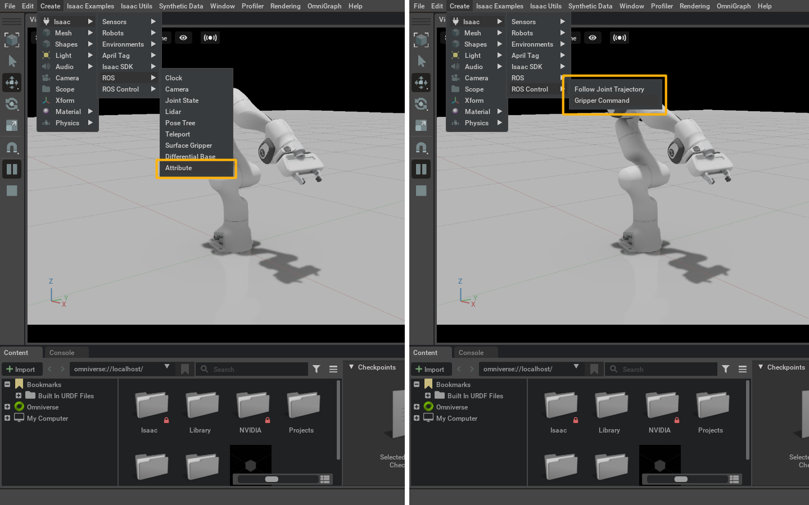

## ROS Bridge UI (`semu` namespace) for NVIDIA Omniverse Isaac Sim

> This extension enables the **menu and commands** of the ROS interfaces for the **ROS extensions** (under the `semu` namespace). The components are compatible with both [ROS](https://www.ros.org/) and [ROS2](https://www.ros.org/)

<br>

**Target applications:** NVIDIA Omniverse Isaac Sim

**Supported OS:** Linux

**Changelog:** [CHANGELOG.md](exts/semu.robotics.ros_bridge_ui/docs/CHANGELOG.md)

**Table of Contents:**

- [Prerequisites](#prerequisites)
- [Extension setup](#setup)
- [Menu items](#menu)
- [Supported commands](#commands)

<br>



<hr>

<a name="prerequisites"></a>
### Prerequisites

This extension requires the following extensions to be present in the Isaac Sim extension path:

- [semu.usd.schemas](https://github.com/Toni-SM/semu.usd.schemas): USD schemas

<a name="setup"></a>
### Extension setup

1. Add the extension using the [Extension Manager](https://docs.omniverse.nvidia.com/prod_extensions/prod_extensions/ext_extension-manager.html) or by following the steps in [Extension Search Paths](https://docs.omniverse.nvidia.com/py/kit/docs/guide/extensions.html#extension-search-paths)

    * Git url (git+https) as extension search path
    
        ```
        git+https://github.com/Toni-SM/semu.robotics.ros_bridge_ui.git?branch=main&dir=exts
        ```

    * Compressed (.zip) file for import

        [semu.robotics.ros_bridge_ui.zip](https://github.com/Toni-SM/semu.robotics.ros_bridge_ui/releases)

2. Enable the extension using the [Extension Manager](https://docs.omniverse.nvidia.com/prod_extensions/prod_extensions/ext_extension-manager.html) or by following the steps in [Extension Enabling/Disabling](https://docs.omniverse.nvidia.com/py/kit/docs/guide/extensions.html#extension-enabling-disabling)

<hr>

<a name="menu"></a>
### Menu items

The following items will be created under the *Create > Isaac* menu once the extension is activated

* *Create > Isaac > ROS*

  * *Attribute*

* *Create > Isaac > ROS Control*

  * *Follow Joint Trajectory*

  * *Gripper Command*

<hr>

<a name="commands"></a>
### Supported commands

The following commands are supported:

* **Attribute:** Get or set prim attributes (ROS service)

    ```python
    class ROSBridgeCreateAttribute(
        path: str = "/ROS_Attribute",
        parent = None,
        enabled: bool = True,
        prims_service_topic: str = "/get_prims",
        attributes_service_topic: str = "/get_attributes",
        get_attr_service_topic: str = "/get_attribute",
        set_attr_service_topic: str = "/set_attribute"
    )
    ```

* **Follow Joint Trajectory:** [FollowJointTrajectory](http://docs.ros.org/en/api/control_msgs/html/action/FollowJointTrajectory.html) action type (ROS action)
    
    ```python
    class ROSControlBridgeCreateFollowJointTrajectory(
        path: str = "/ROSControl_FollowJointTrajectory",
        parent = None,
        enabled: bool = True,
        controller_name: str = "/robot_controller",
        action_namespace: str = "/follow_joint_trajectory",
        articulation_prim_rel = None
    )
    ```
* **Gripper Command:** [GripperCommand](http://docs.ros.org/en/api/control_msgs/html/action/GripperCommand.html) action type (ROS action)

    ```python
    class ROSControlBridgeCreateGripperCommand(
        path: str = "/ROSControl_GripperCommand",
        parent = None,
        enabled: bool = True,
        controller_name: str = "/gripper_controller",
        action_namespace: str = "/gripper_command",
        articulation_prim_rel = None,
        gripper_joints_prim_rel = None
    )
    ```
